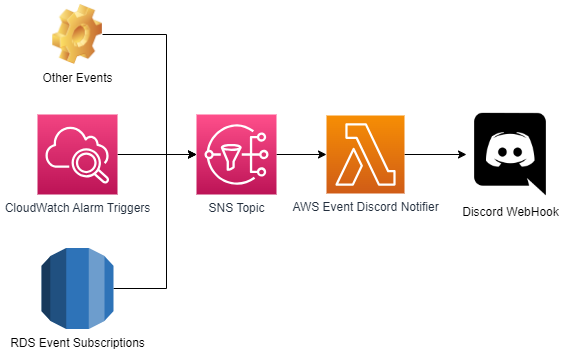

# AWS-discord-notifier
Python project to run on AWS Lambda that can receive notifications from CloudWatch Alarms and other services to send a structured message on Discord using WebHooks.

## Architecture

## Supported Events

* CloudWatch Alarms for SQS
* RDS Aurora Serverless scaling events

Unsupported events are sent to Discord showing the json payload on a code block.

## Python

Code writed and tested on Python 3.9

`python -m pip install -r requirements.txt`

## Deploy

`WEBHOOK_URL` must be set to a valid discord webhook.

## Todo

 - Tests